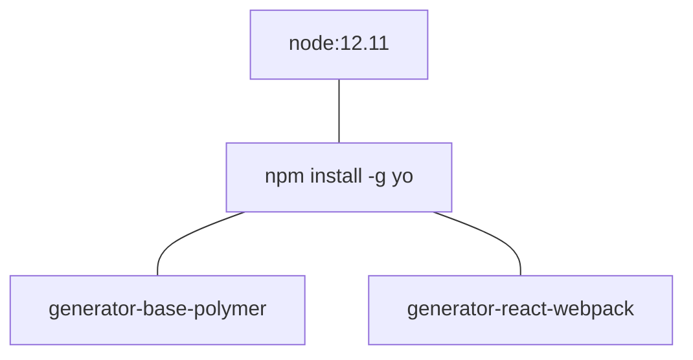

```mermaid
graph TD
    base["node:12.11"]
    yo["npm install -g yo"]
    gen1["generator-base-polymer"]
    gen2["generator-react-webpack"]

    base --- yo
    yo --- gen1
    yo --- gen2
```

### Reference

* [Online Official Mermaid Editor](https://mermaidjs.github.io/mermaid-live-editor/)
